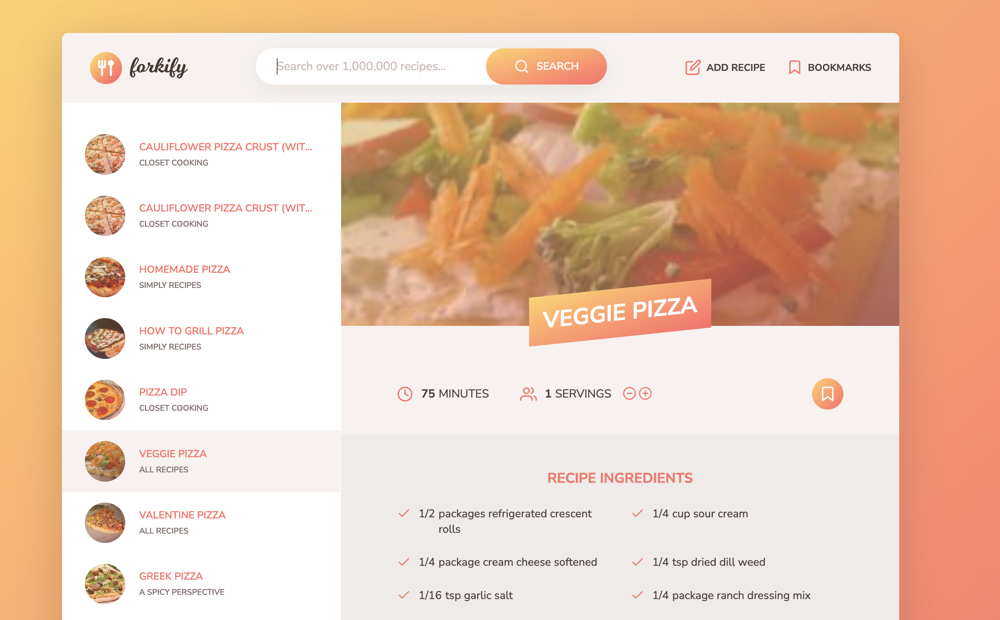

# Forkify Project

Recipe application with custom recipe uploads.

<!-- Table of Contents -->
<details>
<summary>Table of Contents</summary>
<ol>
    <li>
    <a href="#about-the-project">About The Project</a>
      <ul>
        <li>
            <a href="#build-with">Build With</a>
        </li>
      </ul>
    </li>
    <li>
        <a href="#installation">Installation</a>
    </li>
    <li>
        <a href="#acknowledgements">Acknowledgements</a>
    </li>
</ol>
</details>

## About The Project

### Build With

-   ![JavaScript][JavaScript]
-   ![HTML][HTML]
-   ![CSS][CSS]
-   [![NODEJS][NODEJS]][NODEJSUrl]
-   [![SASS][SASS]][SASSUrl]
-   [![Parcel][Parcel]][ParcelUrl]

## Installation

1. Clone the repo

    ```bash
    git clone https://github.com/Genrex7/forkify.git
    ```

2. Install NPM packages

    ```bash
    npm install
    ```

3. Obtain the APi key from [Forkify API](https://forkify-api.herokuapp.com/v2) and paste it in "src/js/config.js"

4. Run the project

    ```bash
    npm start
    ```

## Screenshots



## Acknowledgements

-   [Jonas Schmedtmann](https://twitter.com/jonasschmedtman) for providing the design and the API.
-   [Udemy course](https://www.udemy.com/course/the-complete-javascript-course/) for providing the knowledge to build this project.
-   [Forkify API](https://forkify-api.herokuapp.com/v2) for providing the API.

[JavaScript]: https://img.shields.io/badge/JavaScript-F7DF1E?style=for-the-badge&logo=javascript&logoColor=black
[HTML]: https://img.shields.io/badge/HTML5-E34F26?style=for-the-badge&logo=html5&logoColor=white
[CSS]: https://img.shields.io/badge/CSS-239120?&style=for-the-badge&logo=css3&logoColor=white
[NODEJS]: https://img.shields.io/badge/Node.js-43853D?style=for-the-badge&logo=node.js&logoColor=white
[NODEJSUrl]: https://nodejs.org/en/
[SASS]: https://img.shields.io/badge/Sass-1D5D9B?style=for-the-badge&logo=sass&logoColor=white
[SASSUrl]: https://sass-lang.com/
[Parcel]: https://img.shields.io/badge/Parcel%20-%23C51A4A.svg?&style=for-the-badge&logo=parcel&logoColor=white
[ParcelUrl]: https://parceljs.org/
